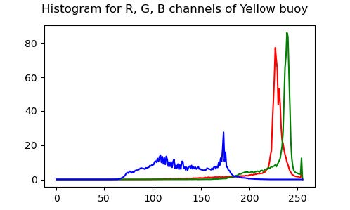
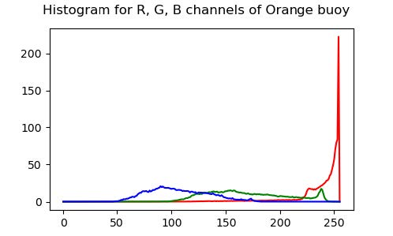
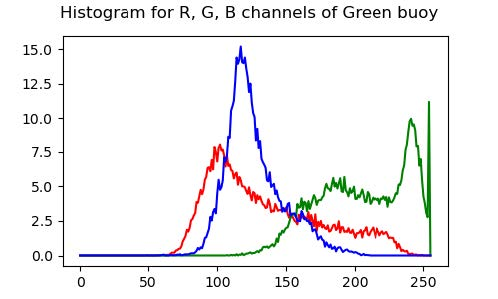
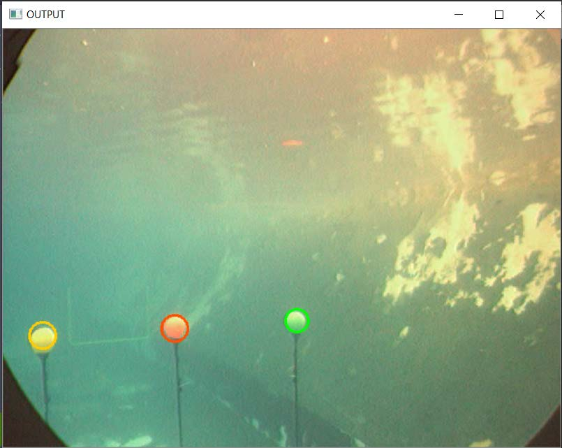

## Underwater_Buoy_Detection
The aim of this project is to understand and implement the segmentation process in image processing
of a color image using Gaussian Mixture Expectation Maximization techniques.

---
## Instructions
### Dependencies
- Python 3
- Opencv 3.4

## Run Using Command Line
```
git clone https://github.com/kartikv97/Underwater_Buoy_Detection.git
cd Underwater_Buoy_Detection/src
```
**Create Custom Dataset** -- To obtain proper output in the 'GMM_Generate_Dataset.py ' file, follow the following steps:

	1. First create a dataset folder in the directory as the code and inside that create three folders with names 'Green', 'Orange', 'Yellow'
	2. When the .py file is run, the frames from the input video is displayed. Select points on this image that mark the region of interest and then close that 
	   image window to save the cropped image.
	3. Verify that the cropped ROI images are saved in their respective directories in the DATASET folder.
    
    RUN :
    python GMM_Generate_Dataset.py


**Histogram Plots for each buoy**
```
python GMM_Generate_Avg_Hist.py
```

**Buoy Detection**
```
python Gaussian_Mixture_Model_for_Buoy_Detection.py
```

## Results

### Output Video
[](https://drive.google.com/drive/folders/1A-jOclXAyxUIZvThQ-erImdqoCyHMtA6)


### Average Histograms Plots for each buoy







### Buoy Detection


